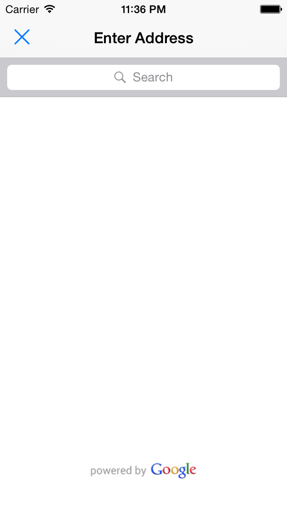
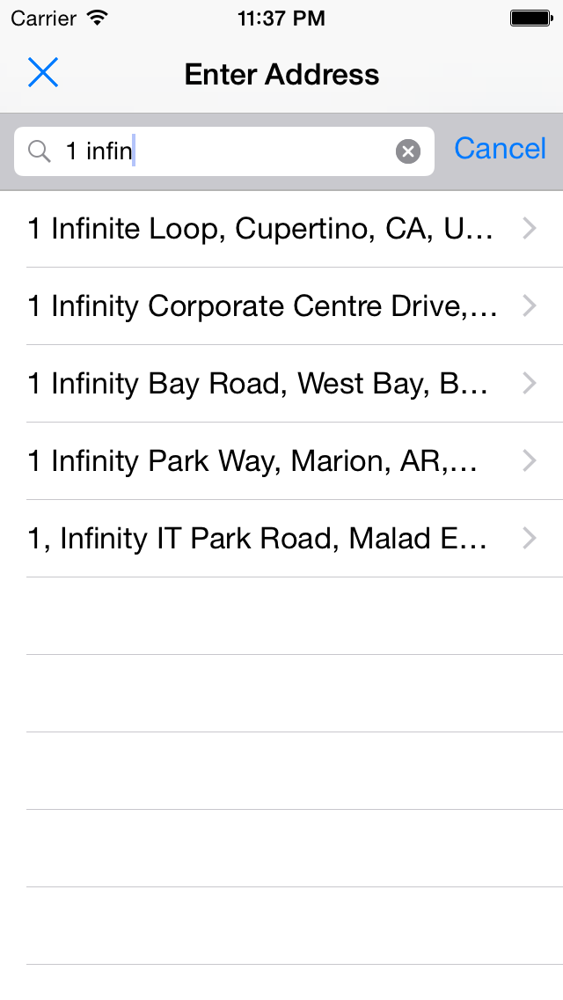
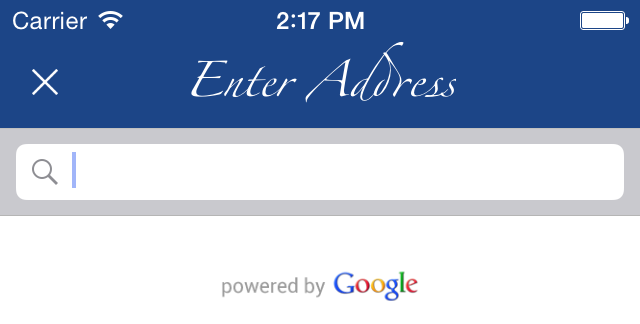

# GooglePlacesAutocomplete

[](https://travis-ci.org/watsonbox/ios_google_places_autocomplete)
[](http://cocoadocs.org/docsets/GooglePlacesAutocomplete/)

A simple [Google Places API](https://developers.google.com/places/documentation/autocomplete) autocompleting address entry view for iOS devices.

There are already a couple of solutions out there for this. GooglePlacesAutocomplete is different because it is 100% Swift, and aims to provide the simplest possible method of entering validated, autocompleted addresses.

No attempt has been made to integrate MapKit since displaying Google Places on a non-Google map is against their terms of service.

<table width="100%">
  <tr>
    <td align="left"></td>
    <td align="right"></td>
  </td>
</table>

----------


## Requirements

- iOS 7.0+
- XCode 7.0+ / Swift 2.0

## Installation

> **Embedded frameworks require a minimum deployment target of iOS 8.**
>
> To use GooglePlacesAutocomplete with a project targeting iOS 7, you must include the source files directly in your project. See the ['manual installation'](#manual) section for instructions.

### CocoaPods

[CocoaPods](http://cocoapods.org) is a dependency manager for Cocoa projects.

CocoaPods 0.36 [adds supports](http://blog.cocoapods.org/CocoaPods-0.36/) for Swift and embedded frameworks. You can install it with the following command:

```bash
$ gem install cocoapods
```

To integrate GooglePlacesAutocomplete into your Xcode project using CocoaPods, specify it in your `Podfile`:

```ruby
source 'https://github.com/CocoaPods/Specs.git'
platform :ios, '8.0'

pod 'GooglePlacesAutocomplete'
```

Then, run the following command:

```bash
$ pod install
```

### Manual

Simply copy `GooglePlacesAutocomplete.swift` and `GooglePlacesAutocomplete.xib` to your project.

Note: Don't forget to add the PoweredByGoogle image to your xcassets.


## Usage

Use the [Google Developers Console](https://console.developers.google.com/) to enabled the 'Google Places API Web Service' and create a 'Server' API key credential. In both cases do *not* use the iOS options.

```swift
import GooglePlacesAutocomplete // Not required when including source files directly in project

let gpaViewController = GooglePlacesAutocomplete(
  apiKey: "[YOUR GOOGLE PLACES API KEY]",
  placeType: .Address
)

gpaViewController.placeDelegate = self // Conforms to GooglePlacesAutocompleteDelegate

presentViewController(gpaViewController, animated: true, completion: nil)
```

`GooglePlacesAutocompleteDelegate` supports three methods:

- `placesFound(places: [Place])`: Invoked whenever the Google Places API is called
- `placeSelected(place: Place)`: Invoked when a new place is selected
- `placeViewClosed()`: Invoked when the view is closed

Here's a [complete example](https://github.com/watsonbox/ios_google_places_autocomplete/blob/master/GooglePlacesAutocompleteExample/GooglePlacesAutocompleteExample/ViewController.swift).

### Place Details

From Google's documentation: "you can request more details about a particular establishment or point of interest by initiating a [Place Details](https://developers.google.com/places/webservice/details) request. A Place Details request returns more comprehensive information about the indicated place such as its complete address, phone number, user rating and reviews."

```swift
place.getDetails { details in
  println(details.name)       // Convenience accessor for name
  println(details.latitude)   // Convenience accessor for latitude
  println(details.longitude)  // Convenience accessor for longitude
  println(details.raw)        // Complete JSON data (see below)
}

/*
  [
    status: OK,
    result: {
      "address_components" = (
        {
          "long_name" = Paris;
          "short_name" = Paris;
          types = (
            locality,
            political
          );
        },
        ...
      );
      geometry = {
        location = {
          lat = "48.856614";
          lng = "2.3522219";
        };
  ...
*/
```

See the [documentation](https://developers.google.com/places/webservice/details#PlaceDetailsResponses) for full response details.

### Location Biasing

The Place Autocomplete API supports biasing results to a specified circle by passing a `location` and a `radius` parameter. This instructs the service to *prefer* showing results within that circle. Results outside of the defined area may still be displayed.

```swift
gpaViewController.locationBias = LocationBias(latitude: 48.8534275, longitude: 2.3582787999999937, radius: 1000)
```


### Styling

The UINavigationController appearance can also easily be changed, for example:

```swift
gpaViewController.navigationBar.barStyle = UIBarStyle.Black
gpaViewController.navigationBar.translucent = false
gpaViewController.navigationBar.barTintColor = UIColor(red: 0.11, green: 0.27, blue: 0.53, alpha: 1.0)
gpaViewController.navigationBar.tintColor = UIColor.whiteColor()
gpaViewController.navigationBar.titleTextAttributes = [NSFontAttributeName: UIFont(name: "Zapfino", size: 16.0)!]
```

<table>
  <tr>
    <td align="left"></td>
  </td>
</table>

Also, to change the contents of the title bar:

```swift
gpaViewController.navigationItem.title = "Enter City"
gpaViewController.navigationItem.leftBarButtonItem = UIBarButtonItem(barButtonSystemItem: UIBarButtonSystemItem.Cancel, target: gpaViewController, action: "close")
```


## Contributing

1. Fork it ( https://github.com/watsonbox/ios-google-places-autocomplete/fork )
2. Create your feature branch (`git checkout -b my-new-feature`)
3. Commit your changes (`git commit -am 'Add some feature'`)
4. Push to the branch (`git push origin my-new-feature`)
5. Create a new Pull Request
